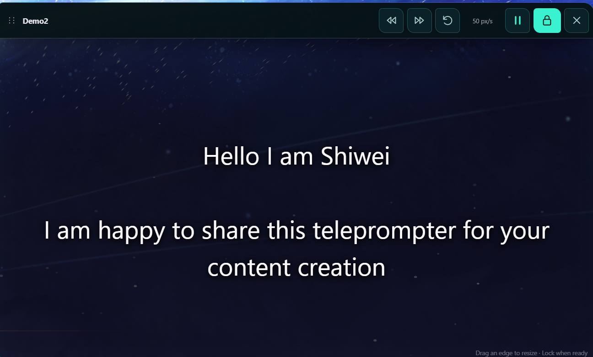
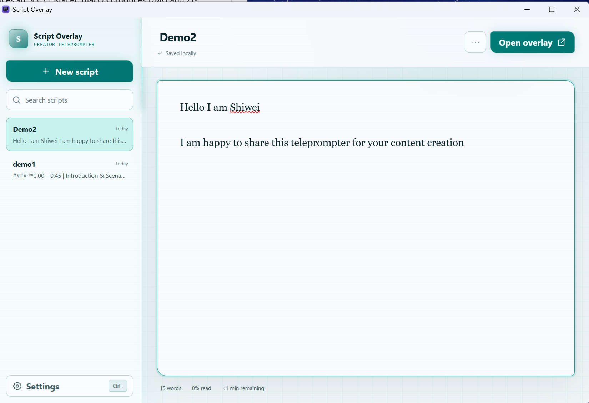
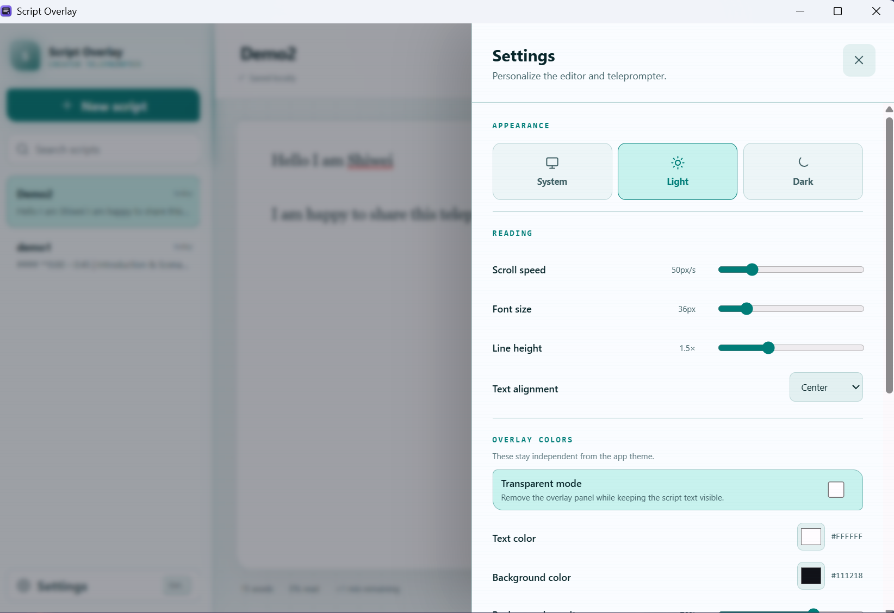

<div align="center">

# Script Overlay

**A private teleprompter that stays visible over any app.**

Write your script, open the always-on-top overlay, and keep your delivery on track while recording tutorials, demos, presentations, or videos. Everything stays on your device.

[**Download for Windows or Mac**](https://github.com/ShiweiGe1999/teleprompter/releases/latest) · [**Watch the 36-second demo**](#see-it-in-action) · [**Support development**](https://buymeacoffee.com/shiweige)

<a href="https://buymeacoffee.com/shiweige"></a>

</div>



## Why Script Overlay

- **Read over any app** — keep a resizable, always-on-top script beside your camera or recording controls.
- **Stay hands-free** — use smooth auto-scroll, global shortcuts, and saved reading progress.
- **See only what you need** — make the overlay transparent and choose your font, colors, opacity, alignment, width, and speed.
- **Work without interruptions** — lock the overlay to pass clicks through to the app underneath, then recover it from the tray or a shortcut.
- **Keep scripts private** — no account, analytics, cloud storage, or runtime network requests.

## See it in action

<video src="https://github.com/ShiweiGe1999/teleprompter/raw/main/docs/media/demo.mp4" width="100%" controls></video>

## Screenshots

### Write and organize scripts



### Tune the reading experience



## Global shortcuts

| Action | Shortcut |
| --- | --- |
| Play / pause | `Ctrl/Cmd + Shift + Space` |
| Lock / unlock | `Ctrl/Cmd + Shift + L` |
| Rewind five seconds | `Ctrl/Cmd + Shift + Left` |
| Increase speed | `Ctrl/Cmd + Shift + Up` |
| Decrease speed | `Ctrl/Cmd + Shift + Down` |

If another app already owns a shortcut, Script Overlay reports the conflict. The tray menu always remains available to unlock the overlay.

## Privacy

“Hide from screen capture” uses Electron’s operating-system content-protection API. This is a best-effort safeguard and may not work with every capture or recording tool.

## Development

Requirements: Node.js 20 or newer and pnpm.

```sh
pnpm install
pnpm dev
```

Quality checks:

```sh
pnpm typecheck
pnpm test
pnpm build
```

## Build an installer

Build unsigned installers on the target operating system:

```sh
pnpm dist
```

Windows produces an NSIS installer. macOS produces DMG and ZIP artifacts for Intel and Apple Silicon. macOS artifacts must be built on a Mac. Because these local builds are unsigned, Windows SmartScreen or macOS Gatekeeper may show a warning.

## Support the project

If Script Overlay helps you record more comfortably, you can [buy me a coffee](https://buymeacoffee.com/shiweige). Your support helps fund maintenance, testing, and future improvements.

<a href="https://buymeacoffee.com/shiweige"></a>
